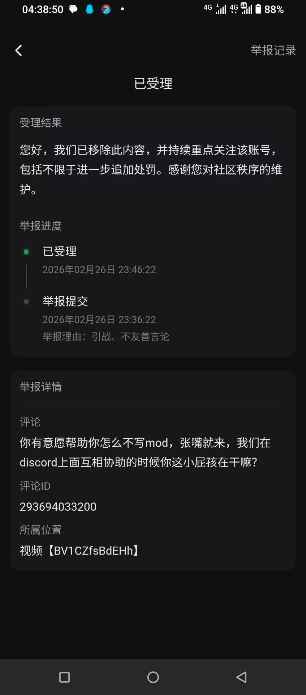
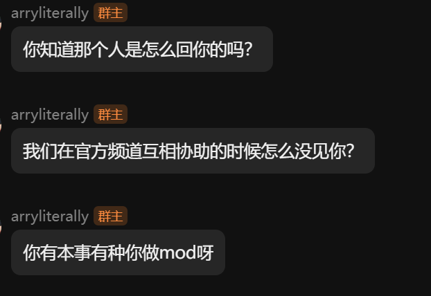
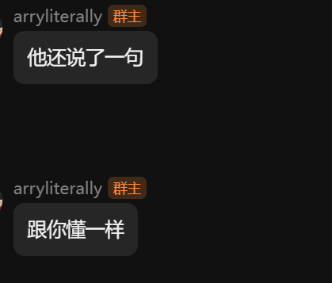
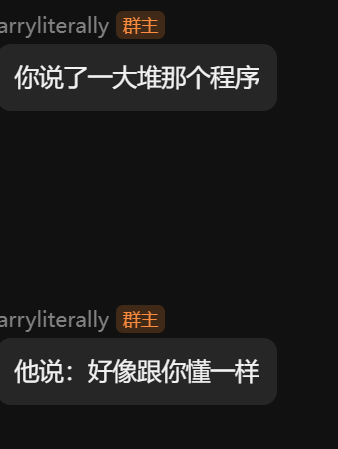

# Allumeria 汉化包+字体模组。

## 鉴于中文互联网来自黑龙江某位电脑高手对我做出的批判性人身攻击评价。（如下）

## 所以我花了两个小时做了一个简单的中文支持。

本Mod行为和早期麦块一致，一整句话如果有Unicode字符例如CJK表中的字符，就会全采用自定义字体。

## 有哪些不足?

 - 性能问题
这显然是最明显的。不过看个人电脑速度如何。

 - 字体错位问题
懒得修，反正影响不算太大

 - 不兼容告示牌
等后面真正能轻而易举获得，估计官方也就加上中文官方支持了。懒得做。

 - 和其他Mod冲突的问题
请考虑 LazyLoader

## 如何使用？
下载本仓库文件，把`res`、`Mods`放到Allumeria本体文件夹就行了，res记得是和原文件合并替换，不是完全删除再放入。

## 有Bug？
可以在本仓库提交Issue

# 声明
本仓库内容与`Allumeria`官方无关。
本项目严格遵守`No AI`原则，所有补丁、翻译数据全部人工完成，承诺绝对不使用`DeepSeek`、`Qwen`、`Doubao`、`Gemini`、`Claude`、`DeepL`、`ChatGPT`、`Grok`等等任何生成式AI智能模型产出的内容。
