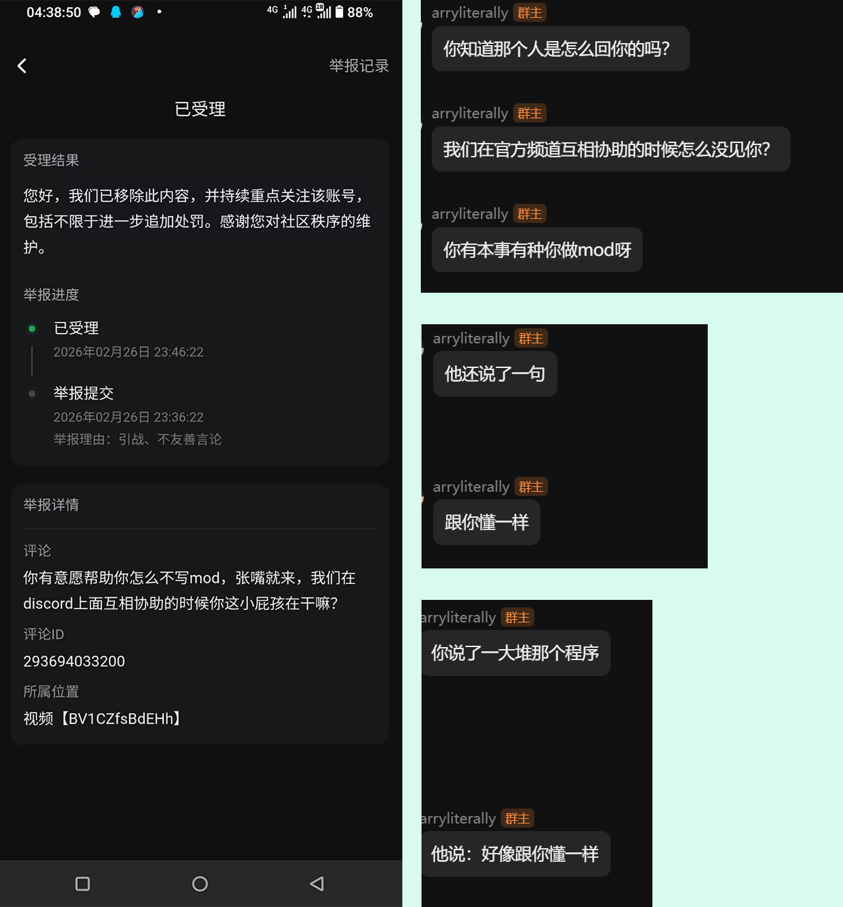
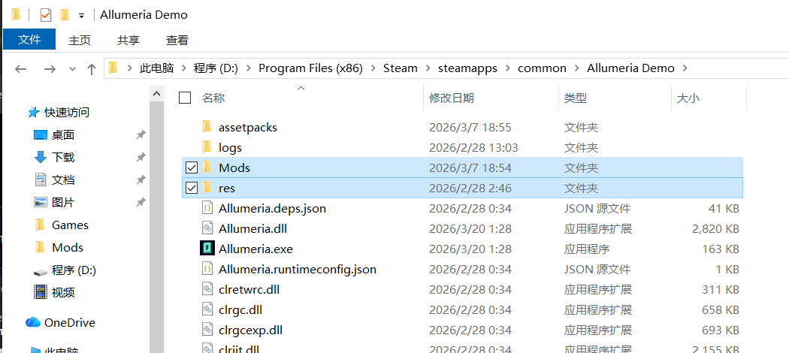

# Allumeria 汉化包+字体模组。

## 鉴于中文互联网来自黑龙江某位电脑高手对我做出的批判性人身攻击评价。（如下）

## 所以我花了两个小时做了一个简单的中文支持。

本Mod行为和早期麦块一致，一整句话如果有Unicode字符例如CJK表中的字符，就会全采用自定义字体。

## 如何使用？   
下载 Release 文件，把下载的AllumeriaChinese_v0.14.X.zip文件解压到游戏根目录就行了，
也就是`res`、`Mods`两个文件夹，记得是和原文件合并替换，不是完全删除再放入。

## 有哪些不足?

 - 性能问题
这显然是最明显的。不过看个人电脑速度如何。

 - 字体错位问题
已基本修复

 - 不兼容告示牌
等后面真正能轻而易举获得，估计官方也就加上中文官方支持了。懒得做。

## 和其他Mod同时使用
请考虑 LazyLoader

## 有Bug？
可以在本仓库提交Issue

# 声明
本仓库内容与`Allumeria`官方无关。
本项目严格遵守`No AI`原则，所有补丁、翻译数据全部人工完成，承诺绝对不使用`DeepSeek`、`Qwen`、`Doubao`、`Gemini`、`Claude`、`DeepL`、`ChatGPT`、`Grok`等等任何生成式AI智能模型产出的内容。
